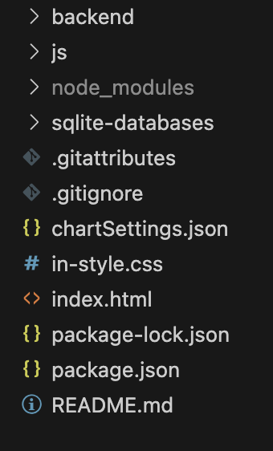
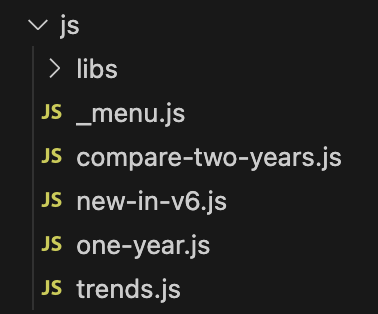
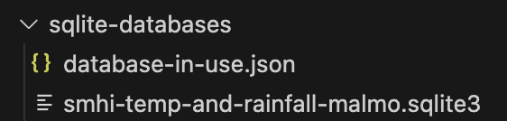
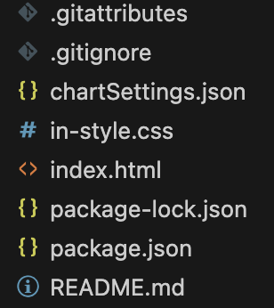

# Statistics Template JS
© ironboy/NodeHill 2025

## Om STJS
Det här mallen **STJS (Statistics Template for JavaScript)** underlättar att arbeta med statistik i JavaScript, samt att kunna visa upp den på ett interaktivt sätt. Den ger bl.a. stöd för:
* Att ställa databasfrågor till en databas ([SQLite](https://sqlite.org/-databaser)).
* Att visualisera data med [Google Charts](https://developers.google.com/chart).
* Att arbeta med statistik med hjälp av JavaScript-biblioteken [Simple Statistics](https://simple-statistics.github.io), ett litet lättarbetat statistik-bibliotek, och [StdLib](https://stdlib.io), ett större bibliotek med många matematiska funktioner.
* Att skriva text som visas på webbsidor med hjälp av [Markdown](https://www.markdownguide.org) - ett enkelt formateringsspråk för text.
* Att skapa en webbplats som är responsiv, dvs. fungerar bra på olika skärmstorlekar, och ordna dina sidor med statistik i ett menysystem. (Under ytan används CSS-biblioteket [Bootstrap](https://getbootstrap.com) för detta.)
* Att skapa **dropdowns** på sidorna och reagera på användarval i dessa, t.ex. genom att låta dessa val ändra urvalet av data i tabeller och diagram.

Vi hoppas att du kommer att få mycket nytta av mallen!

### Vem är mallen för?
* Det här är en mall för dig som vill arbeta med statistik och visualiseringar av statistik *utan* att behöva lära dig så mycket HTML och CSS, men ändå kunna presentera dina rapporter i form av en webbplats!
* Du behöver lite [JavaScript](https://javascript.info)-kunskaper, men du behöver *inte* förstå programspråket i sin helhet, utan endast en del grundsyntax kring variabler och datatyper (strängar, number, arrayer och objekt).
* Du behöver skaffa dig kunskap om hur de inkluderade biblioteken ([Google Charts](https://developers.google.com/chart), [Simple Statistics](https://simple-statistics.github.io) samt [StdLib](https://stdlib.io)) fungerar.
* Kanske läser du till, eller är utbildad, till *dataanalytiker*, *Data Manager* eller liknande?
* Du har kanske tröttnat på omvägar som att räkna ut statistiska mått med Python-bibliotek, sedan skapa diagram via kalkylblad eller liknande och sätta samma dina rapporter i ordbehandlingsprogram?
* Tanken att det ska vara kort väg från arbetet med statistiken till att kunna presentera den snyggt i webbformat!
* Följ gärna länkarna ovan för att lära dig mer!

### Kom igång!
* Installera [Node.js](https://nodejs.org) på din dator i senaste LTS (Long Term Support)-version.
* Ladda hem mallen i zip-format. Zippa upp den och lägg den uppzippade mappen på ett ställe du kommer ihåg i ditt filsystem.
* Ta en kopia av mallen för varje nytt projekt/uppgift/övning etc som du påbörjar.
* Öppna kopian i **VSC** ([Visual Studio Code](https://code.visualstudio.com)).
* Öppna en ny Terminal i **VSC** och skriv **npm install** + ENTER för att installera (en gång per projekt).
* Skriv sedan **npm start** + ENTER i terminalen för att starta en lokal webbserver på som visar webbplatsen som skapas från mallen.

### Filstruktur i mallen
>**Viktigt!**
>
>* Öppna **inte** mallen på fel nivå i **VSC**!
>* Kontrollera att filen **package.json** befinner sig på "grundnivå" (inte inuti någon annan mapp). Då har du öppnat rätt!
>* Att öppna på fel nivå kan leda till en mängd olika problem, t.ex. med sökvägar som inte fungerar.

#### Fil- och mappstruktur på grundnivå


### Mappen backend
Mappen backend ska du sällan (om någonsin) behöva fälla ut och öppna filer i.

* Här finns koden som startar vår webbserver - serverar filer/resurser till webbläsaren.
* Webbservern är även ett viktigt led i koppling till databaser. All trafik till databaser går genom webbservern, fast det för dig ser ut som om du ställer databasfrågorna direkt i din JavaScript-kod i mappen **js** (dvs. i kod som körs på frontend/i webbläsaren).

### Mappen js

#### Exempel på filstruktur i js-mappen


Det här är den viktigaste mappen för dig.
* Genom att ändra i filen **_menu.js** skapar du menysystemet för din webbplats.
* Genom att lägga till olika JavaScript-filer skapar du olika sidor på webbplatsen.
* I JavaScript-filerna kan du
    * Ställa frågor mot en databas.
    * Läsa in data från **JSON**- och **CSV**-filer.
    * Ta fram olika statistiska mått med hjälp av biblioteken [Simple Statistics](https://simple-statistics.github.io) och [StdLib](https://stdlib.io)).
    * Visualisera data som diagram med hjälp av [Google Charts](https://developers.google.com/chart).
    * Visa data i tabeller.
    * Visa upp formaterad text som du skriver i [Markdown](https://www.markdownguide.org)-format.
    * Skapa **dropdowns** och reagera på att användaren gör val i dem.

Allt detta gör du via olika funktionsanrop som finns dokumenterade under huvudrubriken **API**.

I mappen finns även en undermapp med namnet **libs**. Denna behöver du sällan (om någonsin) titta i, men den innehåller olika hjälpbibliotek vars kod du kan använda dig av. (Hur du använder dem finns dokumenterat under rubriken **API**.)

>**Tänk på:**
>* Det du ser i exemplet ovan är bara exempelfiler.
>* När du startar ett eget projekt kan du ta bort dem, utom mappen **libs** och filen **_menu.js**.
>* Filen **_menu.js** ändrar du så att den länkar olika menyval i webbplatsens menysystem till att köra olika JavaScript-filer.

### Mappen node_modules
Mappen **node_modules** skapas först när du har skrivit **npm install**. Den innehåller de bibliotek/moduler som mallen (och framförallt webbservern/backend) är beroende av för att fungera - bl.a. databasdrivers.

Du ska aldrig behöva öppna denna mapp!

### Mappen sqlite-databases


I mappen **sqlite-databases** lägger du de **SQLite**-databaser du vill använda dig av.  (Behöver bara vara en.)

* Upp t.o.m. version 6 (denna version) av mallen kan du bara använda dig av databas från dina JavaScript-filer. I framtida versioner funderar vi på att ändra detta, samt även lägga till möjlighet att koppla sig mot andra typer av databaser än **SQLite**-databaser.
* Det är viktigt att du berättar för **webbservern** vilken databas du vill använda (se nedan).

#### Berätta vilken databas du vill använda
Öppna filen **database-in-use.json** och redigera den, genom att byta namnet inom citattecken till det exakta filnamnet för den databas du vill använda (som ska ligga i samma mapp):

```json
"smhi-temp-and-rainfall-malmo.sqlite3"
```

### Filer utanför mappar



Följande filer ligger inte inneslutna i några undermappar:
* **.gitattributes** innehåller inställningar som gör att **Git** kan översätta de olika sätten att koda tecken/tecknet för 'ny rad' mellan olika operativsystem. Du ska *inte* redigera den.
* **.gitignore** innehåller information om vilka filer som *inte* ska finnas med i git-repot, främst **node_modules**. Du ska *inte* redigera den, men se till att du har den med när du skapar egna Git-repo:n med mallen som utgångspunkt.
* **chartSettings.json** innehåller inställningar för vilken *locale* Google Charts använder - vilket bl.a. påverkar tusentals- och decimalavskiljare, samt vilka delar av Google Charts som laddas - just nu är den inställd på svenska, samt bara grundbiblioteket (*corechart*). Vill du jobba med en annan *locale* eller använda diagram som inte finns med i grundbiblioteket behöver du redigera denna fil.
* **in-style.css** innehåller CSS som styr utseende på webbplatsen. Dock använder vi även CSS från biblioteket **Bootstrap**, som i huvudsak sköter utseende på menyer, textstorlekar etc. Så **in-style.css** har bara lite *extra* styling. Här kan du t.ex. bakgrundsfärg på sidan.
* **index.html** är själva "grundwebbsidan" som "startar allt". Den initierar laddningen av alla JavaScript. Det enda du kan/bör ändra här är titel på webbplatsen (som visas i flikarna i din webbläsare). Den hittar du i taggen **title:** *&lt;title&gt;Sajtrubrik&lt;/title&gt;*.
* **package-lock.json** och **package.json** innehåller information om vilka bibliotek/moduler som ska installeras i **node_modules** när du skriver **npm install**. Ändra inte!
* **README.md** innehåller den dokumentation du läser just nu. (Men det är trevligare att läsa den i webbläsaren - genom att gå till [http://localhost:3005/docs](http://localhost:3005/docs).

## API
I denna sektion av dokumentationen beskriver vi API:t - det *Application Programming Interface* - du kan använda dig av, dvs. vilka funktioner som finns tillgängliga för dig att anropa för att göra olika saker (prata med databaser, beräkna olika statistiska mått och visa diagram etc.).

>**Viktigt!**
>
>I tidigare versionen av mallen, t.o.m. version 5, var du tvungen att skriva s.k. "**import**-statements" för att kunna använda dig av av API:t!
>
>Det behöver/bör du *inte* göra fr.o.m. version 6. Dina kommer åt alla funktioner listade här nedan **utan** att skriva **import**-statements.
>
>Den enda gången **import**-statements numera är aktuella är när du vill exportera/importera variabler, data och funktioner mellan dina egna filer!
>
>*En fördel utöver färre importer:* Du kan i webbläsarens *console* nu anropa alla funktioner direkt!

#### Skapa menyn
* [createMenu](#createmenu)

#### Läsa data från dataset
**Obs!** Samtliga dessa funktioner behöver anropas med **await** framförallt och resultatet behöver tilldelas till en variabel.
* [jload](#jload)
* [csvLoad](#csvload)
* [dbQuery](#dbquery)

#### Visa text, tabeller och dropdowns
* [addToPage](#addtopage)
* [addMdToPage](#addmdtopage)
* [tableFromData](#tablefromdata)
* [addDropdown](#adddropdown)

#### Rita diagram med Google Charts
* [makeChartFriendly](#makechartfriendly)
* [drawGoogleChart](#drawgooglechart)

#### Statistikbibliotek
* [Simple Statistics](simple-statistics)
* [StdLib](stdllib)

### createMenu
>**Obs!** Anropa bara **createMenu** *en* gång i ditt projekt, i filen **_menu.js**.


```js
createMenu('Sajtnamn', [...menyVal...]);
```

#### Exempel: En enkel meny med tre val
Menyvalen är en array av objekt - menyval - i vilken varje objekt har egenskaperna **name**, text som visas i menyn, samt **script** - scriptet som ska köras när menyvalet görs.

```js
createMenu('Sajtnamn', [
  { name: 'Visa ett år', script: 'one-year.js' },
  { name: 'Jämför två år', script: 'compare-two-years.js' },
  { name: 'Hitta trender', script: 'trends.js' }
]);
```

#### Exempel: En meny med tre val, varav ett har tre underval
Här har det andra menyvalet **Jämför tre år** tre underval. Observera att man *inte* kan välja **Jämför flera år** i sig! När man klickar på detta menyval fälls en undermeny ut och låter användaren välja bland valen **Jämför två år**, **Jämför tre år** och **Jämför fyra år**.
```js
createMenu('Sajtnamn', [
  { name: 'Visa ett år', script: 'one-year.js' },
  { name: 'Jämför flera år', sub: [
    {name: 'Jämför två år', script: 'two-year.js'},
    {name: 'Jämför tre år', script: 'three-year.js'},
    {name: 'Jämför fyra år', script: 'four-year.js'},
  ]},
  { name: 'Hitta trender', script: 'trends.js' }
]);
```

>**Var noga med att stava rätt till namnen på scripten!** De måste exakt motsvara filnamn på JavaScript-filer du har skapat i mappen **js**.


### jload

```js
let data = await jload(urlToJsonData);
```

Laddar json från en url som levererar json, t.ex. en json-fil som du lägger på grundnivå i ditt projekt.

#### Exempel
Du har skapat en mapp **json** i ditt projekt och i den lagt filen **pets.json** som innehåller en array av objekt. Du laddar nu in datan så här:

```js
let pets = await jload('/json/pets.json');
```

### csvLoad

```js
let data = await csvLoad(url, separator = ',', stringQuote = '"');
```

Laddar csv-data från en url som levererar en csv-fil och omvandlar den till en array av objekt.

**Notera:**
* Parametern **separator** är *optional*. Den sätts som default till ','. Om CSV-filen skiljer av kolumner med ett annat tecken än ',' anger du det, t.ex. ';'.
* Parametern **stringQuote** är *optional*. Vissa CSV-filer innehåller separator-tecknet inuti textsträngar - och då ska det inte tolkas som ny kolumn. Om CSV-filen använder ett annat tecken än " för att markera att en textsträng börjar/slutar anger du det här, t.ex. ' (enkelt citattecken).

#### Exempel
Du har skapat en mapp **csv** i ditt projekt och i den lagt filen **people.csv**. Filen skiljer av kolumner med semikolon, inte kolon... Du laddar nu in datan så här:

```js
let pets = await csvLoad('/csv/people.csv',';');
```

>**Obs!**
>
>Du måste se till att den översta raden (rad 1) i CSV-filen innehåller kolumnnamnen och att datan börjar på nästa rad (rad 2)!

### dbQuery

```js
let data = async function dbQuery(selectQuery);
```

* Låter dig ställa en valfri SELECT-fråga till din databas. (Se [detta avsnitt](#mappen-sqlite-databases) för hur du kopplar in en databas.)
* Omvandlar svaret till en array av objects.

#### Exempel
Du har en databas i vilken tabellen/vyn **dataWithMonths** iinnehåller en kolumn **year** och du vill plocka ut alla unika värden:

```js
let years = await dbQuery('SELECT DISTINCT year FROM dataWithMonths');
```

**Notera:**
Nu har datan formatet:

```js
[ {year: 2021}, {year: 2022}, {year:2023} ]
```

För att omvandla till en array av nummer:

```js
years = years.map(x => x.year);
```

### addToPage

```js
 addToPage(html);
```

Lägger till html på en sida.

#### Exempel
Vi lägger till en h3-tagg, med texten 'Min rubrik på nivå 3':
```js
addToPage('<h3>Min rubrik på nivå 3</h3>');
```

>**Notera:**
>
>Det är ofta smidigare att använda metoden [addMdToPage](#addmdtopage) som låter dig använda markdown istället för HTML. Markdown är enklare att lära sig!

### addMdToPage

```js
addMdToPage(markdown);
```

Lägger till markdown, som automatiskt omvandlas till HTML, på en sida.

#### Exempel
Vi lägger till en rubrik, två stycken och en punktlista, samt spränger in två variabler:
```js
let catName = 'Maja';
let dogName = 'Fido';

addMdToPage(`
### En rubrik på nivå 3
Ett stycke som handlar om min katt ${catName}. Hon är smart.

Ett stycke som handlar om min hund ${dogName}. Han är:
* Snäll
* Busig
* Tillgiven
`);
```

[Lär dig Markdown](https://www.markdownguide.org)!


### tableFromData

```js
tableFromData({
  data,
  fixedHeader = false,
  numberFormatLocale = 'sv-SE',
  numberFormatOptions = {
    minimumFractionDigits: 0,
    maximumFractionDigits: 2,
  },
  columnNames = [],
})
```

Skapar en tabell från data. Har *en* inparameter som är ett objekt som du kan sätta flera egenskaper i. Dock är bara en obligatorisk, **data**, resten är *optional*.

Här går vi igenom alla:
* **data** - själva datan, ska vara i formatet en array av objects!
* **fixedHeader** - sätt till *true* om du har  en lång tabell och vill att kolumnhuvudet stannar kvar på sidan även när du scrollar.
* **numberFormatLocale** kan sättas om från svenska till andra språk, t.ex. 'en-US' för att ändra hur tusentals- och decimalavskiljare ser ut.
* **numberFormatOptions** med underegenskaperna **minimumFractionDigits**, **maximumFractionDigits** som används för att ange minimum och maximum nummer av decimaler.
* columnNames - en array med kolumnrubriker. Anger du inte denna sätts kolumnrubrikerna till samma som egenskapsnamnen på objekten från **data** - arrayen av objekt.

#### Exempel
En tabell med namn och ålder på två personer:

```js
tableFromData({
    data: [ {name:'Erika',age:27}, {name:'Hans',age:35} ],
    columnNames: ['Namn', 'Ålder']
});
```

>**Notera:**
>
>Oftast vill du förmodligen använda **tableFromData** med data från ett dataset du hämtat från en JSON-fil, CSV-fil eller från en databas.

### addDropdown

```js
let chosenItem = addDropdown(label, data, initialValue = '');
```

Med **addDropdown** lägger du enkelt till en dropdown (även kallad **select** efter sin html-tagg) till din sida. Detta ger dig möjlighet att låta saker hända (filtering av data, omritning av diagram etc.) beroende på vad användaren gör för val i dropdownen.

#### Parametrar
* **label** - vad som ska stå som förklaring före din dropdown.
* **data** - en array av strängar som utgör valen/alternativen som visas i din dropdown.
* **initialValue** - *optional* - om du inte vill att det första valet är förvalt kan du skriva strängen som motsvarar ett annat av de möjliga valen här.

#### Returvärde
* Fånga upp det valda värdet/strängen som **addDropdown** returnerar i en variabel!
* Sedan kan du bygga konditionell logik kring vad som är valt, med if-else, eller med villkorsoperatorer.

#### Exempel

```js
let yourAge = addDropdown('Din ålder:',['Under arton', 'Över arton']);
addMdToPage(yourAge == 'Under arton' ? 'Du är inte myndig.': 'Du är myndig.');
```

>**Viktigt!**
>
>Varje gång användaren gör ett nytt val i din dropdown kör ditt JavaScript som utgör/motsvarar sidan igen och sidan genereras om! (Övriga dropdowns på sidan bibehåller dock sina värden, så du kan ha flera  dropdowns på sidan som alla kommer ihåg sina värden.)

>**Notera:**
>
>Ofta vill du förmodligen använda **addDropdown** med data från ett dataset du hämtat från en JSON-fil, CSV-fil eller från en databas.

### makeChartFriendly

```js
let dataForChart = makeChartFriendly(arrayOfObjects, ...columnNames);
```

Vi arbetar oftast med data i formatet arrayer av objekt. Det är så data returneras från databaser ochCSV-filer, samt även ofta är organiserad i JSON-filer!

Men **Google Charts** tycker om en lite annan datastruktur: Arrayer av arrayer, där den översta arrayen motsvarar kolumnhuvuden.

Funktionen **makeChartFriendly** omvandlar till ett dataformat **Google Charts** gillar, vilket låter dig förbereda utvald data för diagramvisning!

#### Exempel 2
```js
// Data som en array av objekt
let data = [
  { "name": "Erika", "age": 27 },
  { "name": "Hans", "age": 35 }
];

let dataForChart = makeChartFriendly(data);
```

**Resultat, dataForChart innehåller:**
```js
[
  [ "name", "age" ],
  [ "Erika", 27 ],
  [ "Hans", 35 ]
]
```

#### Exempel 2
Med egna kolumnnamn:

```js
// Data som en array av objekt
let data = [
  { "name": "Erika", "age": 27 },
  { "name": "Hans", "age": 35 }
];

let dataForChart = makeChartFriendly(data, 'Namn', 'Ålder');
```

**Resultat, dataForChart innehåller:**
```js
[
  [ "Namn", "Ålder" ],
  [ "Erika", 27 ],
  [ "Hans", 35 ]
]
```

###  drawGoogleChart

```js
drawGoogleChart({
    type: 'TypeOfDiagram',
    data: dataInChartFriendlyFormat,
    options: optionsForTheChart
});
```
Med **drawGoogleChart** kan vi rita diagram. Allt som går att göra med *options*, *diagramtyper* etc. enligt [Googles dokumentation](https://developers.google.com/chart) fungerar, men syntaxen är något komprimerad för att vara snabbare att arbeta med än i Googles egna exempel!

#### Exempel
Ett exempel i vilket vi även använder [makeChartFriendly](#makechartfriendly) direkt för att omvandla datan till ett format som Google Chart tycker om.

```js
drawGoogleChart({
  type: 'LineChart',
  data: makeChartFriendly(dataForChart, 'månad', '°C'),
  options: {
    height: 500,
    chartArea: { left: 50, right: 0 },
    curveType: 'function',
    pointSize: 5,
    pointShape: 'circle',
    vAxis: { format: '# °C' },
    title: `Medeltemperatur per månad i Malmö ${currentYear} (°C)`
  }
});
```

>**Notera:**
>
>För att få diagrammen *responsiva*, dvs. att de anpassar sig till skärmstorleken, bör du undvika att sätta en **width** på dem under options (för Google Charts förstår bara pixelbredder och inte procentuella bredder).
>
>Istället kan du göra som här, sätta *left* och *right*-värden! (Tänk dock på att inte sätta *left* till 0 - för då försvinner siffrorna på vänster/vertikal-axeln.)

### Simple Statistics
Statistikbiblioteket [Simple Statistics](https://simple-statistics.github.io) är ett objekt/modul som innehåller många olika funktioner. Du behöver fånga upp resultatet av beräkningar i variabler!

* Du behöver inte skriva ut **simpleStatistics** utan kan skriva **s**.


#### Exempel på användning
Räkna ut ett medelvärde genom att anropa **s.mean**:

```js
let mean = s.mean([1,2,3]);
```

### stdLib
[StdLib](https://stdlib.io) är ett större bibliotek med många matematiska funktioner. Den består av ett objekt/modul med underobjekt (för olika delområden), vilka i sin tur funktioner är sorterade under.

#### Exempel på användning
Ett tvåsidigt T-test mellan två dataserier kan genomföras så här:

```js
let result = stdLib.stats.ttest2([1,2,4],[1,2,3]);
let pValue = result.pValue;
```

I tidigare versioner av mallen hade vi även med ett statistikbibliotek som heter **jerzy**. Den enda funktionen vi har nytta av från detta bibliotek, som inte finns i något av de andra, är *Shapiro-wilks*-testet för *normalfördelning*. Detta har vi därför "ympat in" så att det kan nås från **stdLib**, så här:

```js
let result = stdLib.stats.shapiroWilkTest([1,1,2,3,3]);
let pValue = result.p;
```

## MIT License
Copyright © 2025 ironboy/NodeHill

Permission is hereby granted, free of charge, to any person obtaining a copy
of this software and associated documentation files (the "Software"), to deal
in the Software without restriction, including without limitation the rights
to use, copy, modify, merge, publish, distribute, sublicense, and/or sell
copies of the Software, and to permit persons to whom the Software is
furnished to do so, subject to the following conditions:

The above copyright notice and this permission notice shall be included in all
copies or substantial portions of the Software.

THE SOFTWARE IS PROVIDED "AS IS", WITHOUT WARRANTY OF ANY KIND, EXPRESS OR
IMPLIED, INCLUDING BUT NOT LIMITED TO THE WARRANTIES OF MERCHANTABILITY,
FITNESS FOR A PARTICULAR PURPOSE AND NONINFRINGEMENT. IN NO EVENT SHALL THE
AUTHORS OR COPYRIGHT HOLDERS BE LIABLE FOR ANY CLAIM, DAMAGES OR OTHER
LIABILITY, WHETHER IN AN ACTION OF CONTRACT, TORT OR OTHERWISE, ARISING FROM,
OUT OF OR IN CONNECTION WITH THE SOFTWARE OR THE USE OR OTHER DEALINGS IN THE
SOFTWARE.